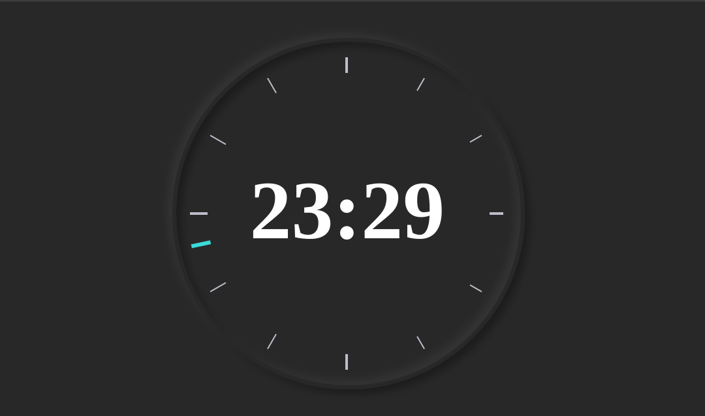

<h1 align="center"> RELÓGIO ANALÓGICO </h1>

## 🚀 Tecnologias

Esse projeto foi desenvolvido com as seguintes tecnologias:

- HTML e CSS
- JavaScript
- Git e Github

## 💻 Projeto

Você pode visualizar o layout do projeto através [DESSE LINK](https://clock-eta-two.vercel.app/). 
